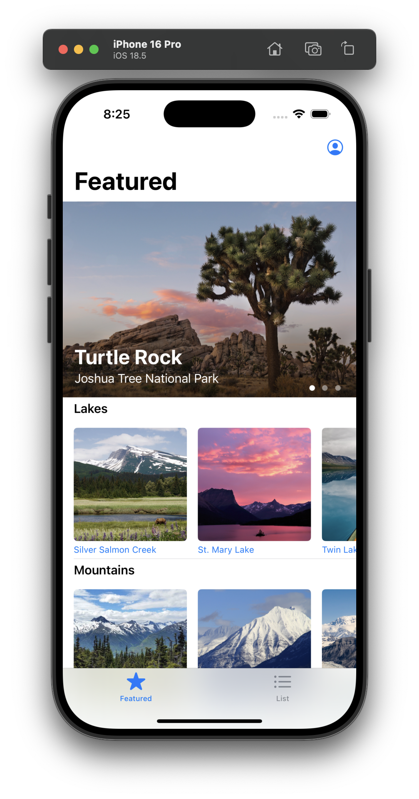
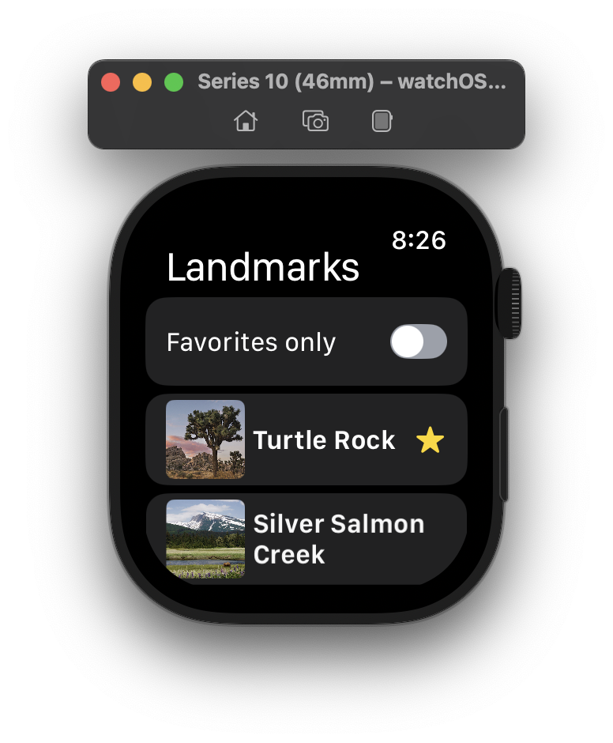
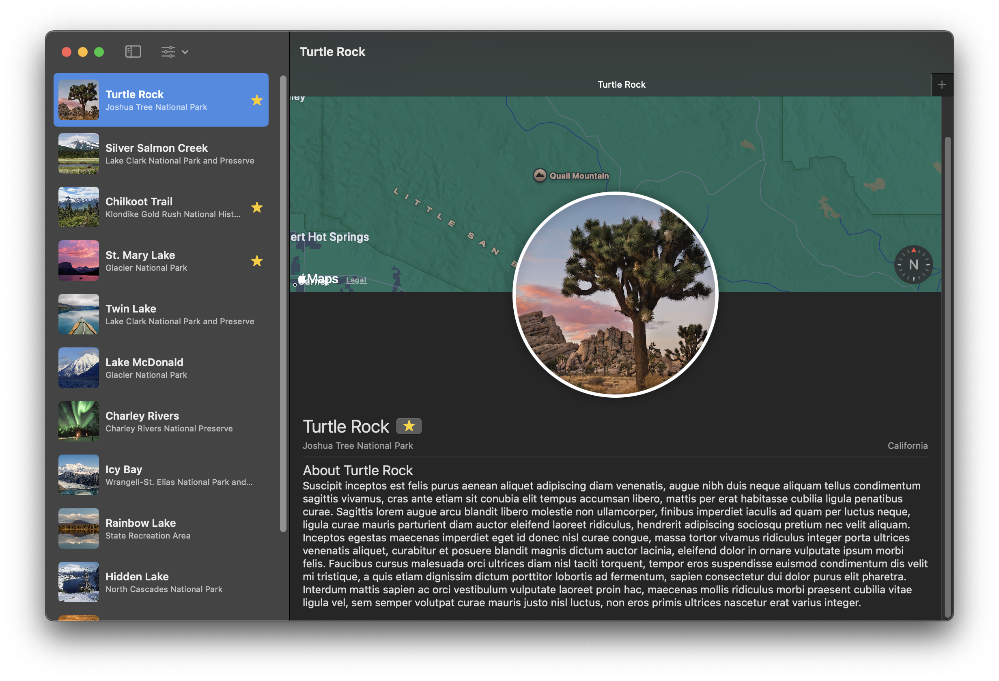

# ⚲ Landmarks

A cross-platform SwiftUI app showcasing landmarks across iOS, watchOS, and macOS.

## Platform Previews

| Platform | Preview |
|----------|---------|
| iOS |  |
| watchOS |  |
| macOS |  |

## Features

- Browse a curated list of landmarks
- Detail views with imagery and descriptive text
- Favorites management synced across platforms
- Dark Mode, Dynamic Type, and VoiceOver support
- Single SwiftUI codebase with platform-specific tweaks where it matters

## Requirements

- Xcode 15 or later  
- Swift 5.9 or later  
- iOS 16+, watchOS 9+, macOS 13+ (Ventura)
